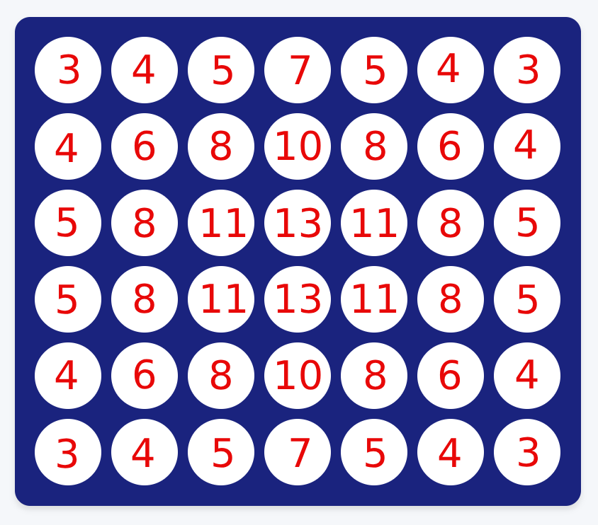

# **Connect 4 with AI Agents**

## **1. Game Description**

Connect 4 is a strategy game for two players. Each player drops colored discs into a vertical grid. The goal is to make as many "connect-fours" as possible—this means getting four of your discs in a row vertically, horizontally, or diagonally. The winner is the player with the most "connect-fours" when the board is full.

This implementation has a human vs. computer mode where the computer uses artificial intelligence (AI) to play.

---

## **2. Algorithms Used**

### **2.1 Minimax Algorithm**

The Minimax algorithm looks at all possible moves to decide the best one. It assigns a score to each move based on how good it is for the computer.

### **2.2 Minimax with Alpha-Beta Pruning**

This is an improved version of the Minimax algorithm. It skips over unnecessary parts of the decision-making process, making it faster while still choosing the best move.

### **2.3 Expected Minimax**

This algorithm adds an element of uncertainty. It considers that the disc might not always fall into the intended column but could slide into an adjacent column with a certain probability. This makes the AI's decisions more realistic.

---

## **3. Scoring System**

In this implementation, the score of the game is based on the total number of "connect-fours" each player achieves. Instead of stopping the game after the first "connect-four," the game continues until the board is completely filled. The player with the higher number of "connect-fours" wins.

---

## **4. Heuristic Design**

The heuristic for the minimax algorithm consists of two components:

1. **Dynamic Component**:
    
    Calculated during the traversal of the minimax tree, this part evaluates the utilization of the disk in the current move. It prioritizes:
    
    - **Blocking the Opponent's Consecutives**: Preventing the opponent from forming consecutive disks.
    - **Completing the Agent's Consecutives**: Focusing on forming consecutive disks for the agent.
2. **Terminal Node Evaluation**:
    
    At the terminal nodes, the heuristic evaluates the entire board by:
    
    - Assigning **weights to disk positions** based on their potential to participate in winning combinations (4-in-a-row).
        
        
        
    - Counting consecutive disks (4, 3, 2) for both the agent and the opponent, assigning higher importance to longer consecutives.
    - Utilizing **column ordering** based on proximity to the center, as central positions provide more opportunities for forming winning combinations, aiding in better pruning during tree traversal.

---

## **5. Time Complexity and Performance Analysis**

The time complexity analysis for MiniMax, MiniMax with Alpha-Beta Pruning, and Expectiminimax algorithms is shown below:

| Depth | MiniMax Nodes | MiniMax Time (s) | Pruning Nodes | Pruning Time (s) | Expecti Nodes(with memo) | Expecti Time (s)(with memo) |
| --- | --- | --- | --- | --- | --- | --- |
| 1 | 8 | 0.001 | 8 | 0.001 | null | null |
| 2 | 57 | 0.003 | 24 | 0.001 | 27 | 0.000 |
| 3 | 400 | 0.016 | 110 | 0.004 | null | null |
| 4 | 2066 | 0.078 | 242 | 0.008 | 209 | 0.004 |
| 5 | 9906 | 0.341 | 1281 | 0.054 | null | null |
| 6 | 39747 | 1.330 | 1341 | 0.051 | 1483 | 0.023 |
| 7 | 154694 | 4.805 | 13894 | 0.595 | null | null |
| 8 | 538413 | 16.884 | 17519 | 0.576 | 7671 | 0.125 |
| 9 | 1838810 | 53.684 | 86039 | 3.266 | null | null |
| 10 | 5777689 | 167.757 | 284112 | 10.220 | 36791 | 0.550 |

| Depth | Expecti Nodes (without memo) | Expecti Time (s)(without memo) |
| --- | --- | --- |
| 1 | null | null |
| 2 | 27 | 0.001 |
| 3 | null | null |
| 4 | 521 | 0.020 |
| 5 | null | null |
| 6 | 9907 | 0.362 |
| 7 | null | null |
| 8 | 188241 | 7.181 |
| 9 | null | null |
| 10 | 3576587 | 132.720 |

As shown in the table, Alpha-Beta Pruning significantly reduces the number of nodes expanded and execution time, especially at higher depths. The Expectiminimax algorithm shows better performance than basic MiniMax but is less efficient than Alpha-Beta Pruning.

---

## **6. Sample Runs**

- MiniMax at depth = 1

- MiniMax with Alpha-beta pruning at depth 2

- Expectiminimax at depth = 2

## Contributors

- AbdElRahman Bassam
- AbdElRahman Osama
- Ahmed Youssef
